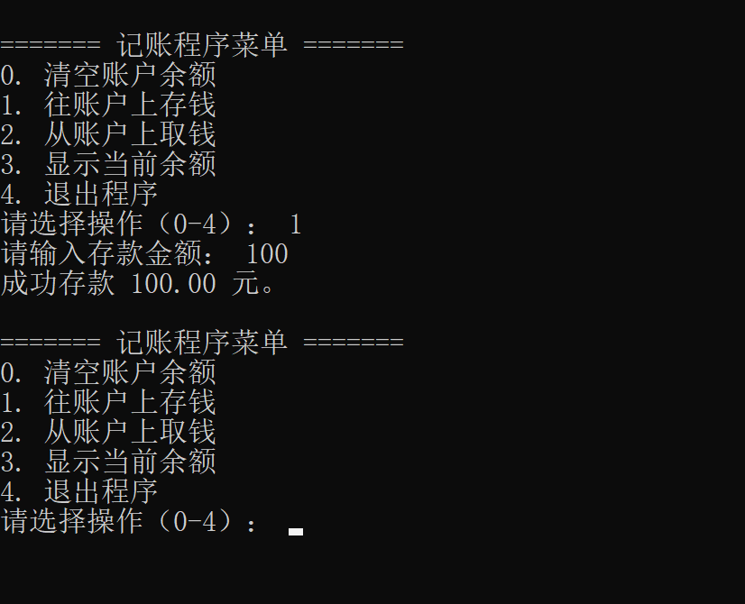
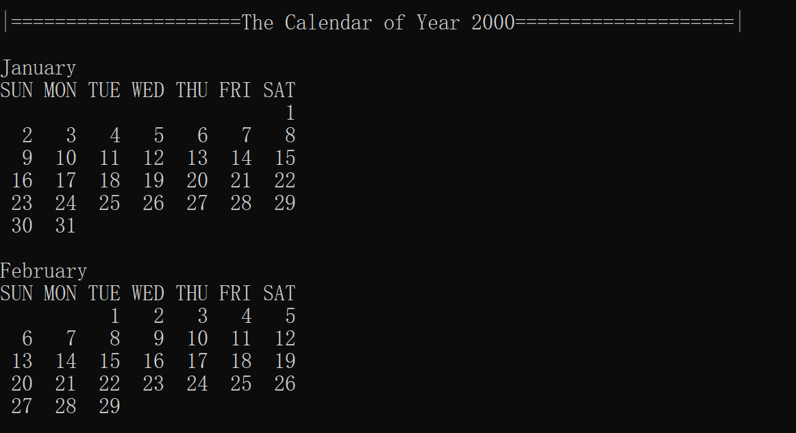
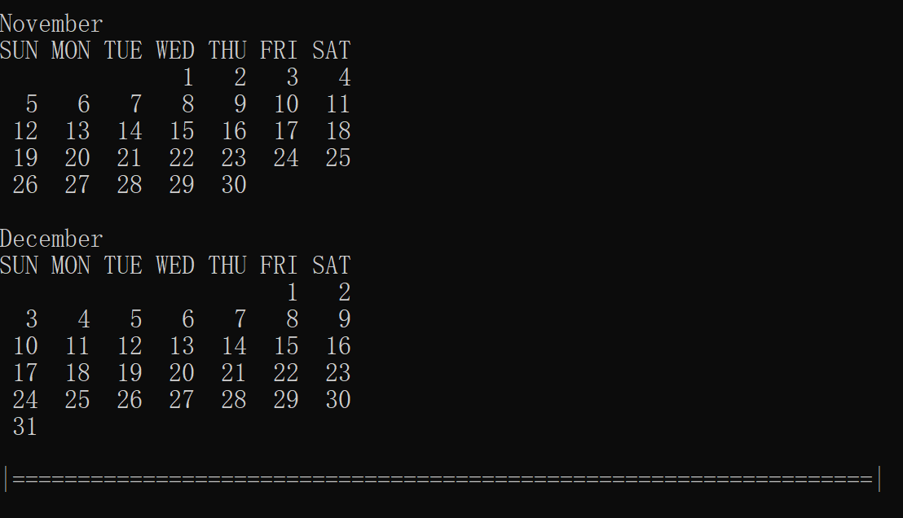
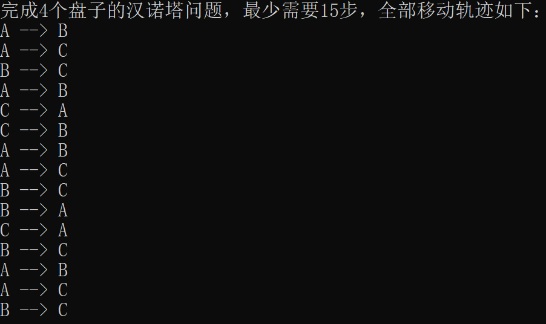

# C语言

## 1001 C语言基础01

一、下列关于C语言的说法，**正确**的是：(多选)

A: C语言之父是詹姆斯·高斯林（James Gosling）

B: C语言来源于贝尔实验室，由Ken Thompson（肯·汤普逊）、Dennis Ritchie（丹尼斯·里奇）共同发明

C: C语言是研发Unix操作系统的副产品

D: C语言第一个标准化版本是C90/C89（ANSI C）

E: C语言的官方标准语法特性在不同平台编译器中，都是一样的。前提是这些平台遵循C标准实现

F: C语言相对于汇编语言、机器语言是高级语言，但比起绝大多数高级编程语言比如C++、Java等，它更像低级语言

二、下列关于进程，关于虚拟内存空间的说法**正确**的是：(多选)
```txt
A：运行中的程序称之为进程。
B：每个进程都有自己独立的虚拟内存空间
C：虚拟内存空间和物理内存之间存在映射的关系，由操作系统和硬件共同管理这种映射关系
D：进程的虚拟内存空间模型包含代码段、数据段、堆空间、栈空间、内核区域等部分
E：内存地址就是虚拟内存空间中某1个字节区域的唯一性标识。
F：变量地址就是变量所占内存空间的第一个字节的内存地址。
G：所谓小端存储法，就是将此数据的最低有效位字节存储在低内存地址上
H：所谓大端存储法，就是将此数据的最高有效位字节存储在低内存地址上
```

三、关于C语言标识符命名规范和风格，以下哪些说法是正确的？（多选）

```txt
A：标识符可以以数字开头。
B：标识符中可以包含字母、数字或下划线。
C：C语言中的关键字可以用作标识符。
D：标识符的命名应避免使用汉语拼音，除非特殊情况。
E：标识符中禁止出现除字母、数字和下划线以外的其他字符。比如汉字，日语假名等
F：标识符对大小写不敏感，因此num和Num被视为同一个标识符。
G：标识符命名的核心原则是"见名知意"
H：标识符的命名风格可以用"下划线法"和"驼峰法",可以随意混用这两种风格
```

四、关于变量在C语言中的声明、初始化、赋值、定义以及其它相关概念，以下哪些说法是不正确的？（多选）

```txt
A：声明一个变量是告诉编译器变量的类型和名称，并且一定会最终分配内存空间
B：变量的第一次赋值称之为初始化
C：一个变量声明初始化后,再次改变取值,称之为赋值
D：局部变量如果仅声明那么取值将是一个随机值,使用随机值会导致未定义行为
E：未定义行为指的是程序行为并未在标准中明确规定的场景
F：未定义行为可能可以运行出一个结果,可能导致程序崩溃,可能报错,可能出现莫名其妙的结果等
G：在编程时出现未定义行为也无所谓
H：变量的三要素是: 变量名,数据类型,取值
```

### 提交环境测试

1. 
   ```txt
   (1) 从源代码生成可执行程序包含哪几个步骤，请用自己的话描述每个步骤的作用。
   (2) 预处理阶段会执行预处理指令，我们讲过哪几种预处理指令？编写带参数的宏 (宏函数) 应该注意哪些事项？宏函数优于普通函数的地方在哪里？
   (3) 什么是进程？进程的虚拟内存空间包含哪几部分？
   ```

### 能力测试题

1. 
   ```txt
   1.键盘输入一名学生的语文、数学和英语成绩（均为整数百分制）。计算其平均成绩，并保留两位小数打印显示。
   2.键盘输入一个位于(0, 1)范围内的浮点数，并将其转化为百分比形式，结果保留一位小数。例如：输入0.12转换为12.0%，而输入0.1234转换为12.3%。
   ```

2. 编写一个程序实现以下需求：
   ```txt
   1.用户键盘录入一整行字符数据，包含数字和字母。
   2.当用户按下回车键后结束数据录入。
   3.请统计用户输入的一整行字符数据中，数字和字母分别有多少个。
   ```

3. 用运算符实现以下算法
   ```txt
   1.定义一个函数，判断某个整数是否为奇数。
   2.给定一个正整数，请定义一个函数判断它是否为2的幂(1, 2, 4, 8, 16, ....)。
   3.给定一个不为0的整数，编写函数找出它值为1的最低有效位 (称之为Last Set Bit)。LSB是1表示此整数的最低位就是1,2则表示倒数第二位是第一个1,4表示倒数第三位是第一个1....
     一个示例如下：
     > 输入：n = 24
     > 输出：8
     > 解释：24的二进制表示为 11000，值为 1 的最低有效位是倒数第四位，则输出 2^3，即输出的结果8。
   4.给定两个不同的整数 a 和 b，请交换它们两个的值。(这里不要定义函数来实现)
   5.给定一个非空的整数数组nums，已知某个元素只出现了一次，其余元素均出现两次，那么请你找出这个只出现一次的元素。
   ```
   ```txt
   扩展题目:
   给定一个非空的整数数组nums，已知有两个元素只出现了一次，其余元素均出现两次，那么请你找出这两个只出现一次的元素。
   ```

4. 利用switch语句编写一个程序，先键盘录入一个成绩(int整数)，然后把用数字表示的成绩转化为字母表示的成绩等级。评定规则是：
   ```
   a. 90~100为A
   b. 80~89为B
   c. 70~79为C
   d. 60~69为D
   e. 0~59为F
   f. 如果成绩高于100或者低于0，则显示出错消息。
   ```

5. 经典循环案例：请求出所有的水仙花数，并统计总共有几个。
   ```txt
   a. 所谓的水仙花数是指一个三位数，其各位数字的立方和等于该数本身。
   b. 举例：153就是一个水仙花数，153 = 1 * 1 * 1 + 5 * 5 * 5 + 3 * 3 * 3 = 1 + 125 + 27 = 153
   ```

6. 
   ```c
   int count = 0;
   int sum = 0;
   int i;
   while (count < 5) {
   	scanf("%d", &i);
   	if (i == 0) {
   		// 输入0就不必要累加了
   		continue;
   	}
   	sum += i;
   	count++;
   }
   printf("sum = %d\n", sum);
   
   -----------------------------------
   
   #include <stdio.h>
   
   int main(void) {
   int sum = 0;
   int i;
   
   for (int count = 0; count < 5; count++) { 
     scanf("%d", &i);
     if (i == 0) {
         // 输入0就不必要累加了
         continue;
     }
     sum += i;
   }
   
   printf("sum = %d\n", sum);
   return 0;
   }
   ```
   以上两段代码一个使用while循环实现，一个使用for循环实现。
   那么它们实现的功能有什么区别呢？为什么有这样的区别？

7. 现在我们就来开发一个简单的交互式程序：
   ```txt
   程序将为用户提供选择菜单：
   
   1. 清空账户余额
   2. 往账户上存钱
   3. 从账户上取钱
   4. 显示当前余额
   5. 退出程序。
   ```
   选择项分别用整数 0、1、2、3 和 4 表示，账户余额可以用一个简单的局部变量表示。交互程序大致界面如下：

### 总结

## 1002 C语言基础02

1. 下列关于从源代码到可执行程序转换过程中各个步骤的描述，哪些是正确的？（多选）

   ```html
   A：广义来说，C程序从源代码到可执行程序，要经历编译和链接的过程
   B：广义的编译包含预处理、编译、汇编三个过程
   C：狭义的编译指的是将源代码转换为汇编代码，处理.i文件生成.s文件的过程
   D：在预处理阶段，会处理#开头的预处理指令，并忽略源代码中的注释。
   E：预处理指令以#符号开始
   F：预处理指令是一个特殊指令，include、define等是关键字
   G：广义编译过程若出现错误表现出来就是编译错误，链接过程出错表现出来就是链接错误
   ```

2. 下列关于C语言的编译错误和链接错误的描述中，哪些是正确的？（多选）

   ```html
   A：编译错误往往是由于语法错误引起的，如缺少分号或者括号不匹配。
   B：链接错误发生在编译阶段，主要由于源代码中的语法问题。
   C：链接错误发生在链接阶段，主要是因为编译器找不到某些函数的定义。
   D：编译错误可以通过阅读代码逻辑来解决，而链接错误通常需要检查库文件或函数声明。
   ```

3. 写一个程序，实现分数相加。用户以分子/分母的形式输入分数，程序打印相加后的结果(化为最简分数)。如：

   ```c
   输入:
   Enter first fraction: 5/6     
   Enter second fraction: 3/4
   输出：
   The sum is 19/12
   ```

   （注：利用欧几里得算法求最大公约数，进行分数简化）

4. 简答题

   (a) `double ans = 10.0 + 2.0 / 3.0 − 2.0 ∗ 2.0;`请在适当的位置插入()，使得 ans = 11.0.

   (b) `double ans = 18.0 / SQUARED(2 + 1);` 如果宏函数定义如下，请写出对应 ans 的值。

   ```c
   #define SQUARED(x) x*x
   #define SQUARED(x) (x*x)
   #define SQUARED(x) (x)*(x)
   #define SQUARED(x) ((x)*(x))
   ```

   (c) 请解释下面代码为什么错了，并改正它。

   ```c
   1) #include <stdio.h>;
   2) int function(void arg1){        
          return arg1-1;   
      }
   3) #define MESSAGE = "Happy new year!"
   ```

### 补充作业

1. **用C语言编写程序实现以下需求：**

   编写一个函数，输入一个公元年份（如2004），判断该年是否为闰年，并返回判断结果。

   **平年闰年的规则如下**：

   1. 如果年份不是4的倍数，则是平年。
   2. 如果年份是4的倍数但不是100的倍数，则是闰年。
   3. 如果年份是100的倍数但不是400的倍数，则是平年。
   4. 如果年份是400的倍数，则是闰年。

   要求使用bool类型作为函数的返回值。

   **注意：日历有一系列的题目，这道题编写的函数在下一道题目中可能会用到。**

2. **用C语言编写程序实现以下需求：**

   紧接着上一问，编写一个函数，输入年、月、日，计算并输出下一天的日期。

   比如：

   传入函数的日期是2004年3月31日

   那么函数体内部要直接打印下一天是：2004年4月1日

   要求：

   键盘录入年月日日期时，键盘录入的格式是："年/月/日"

   **注意：日历有一系列的题目，这道题编写的函数在下一道题目中可能会用到。**

   **提示：**

   **求下一天的日期，无非就是传入日期的天数加1，但加1后天数有可能"溢出"，所以需要知道输入的月份有几天。**

   **天数+1如果溢出，天数就需要归1，然后让月份+1**

   **月份+1如果溢出，那就需要将年份+1**

   **当然年份不需要考虑溢出...**

3. **用C语言编写程序实现以下需求：**

   编写一个函数，输入两个日期（年/月/日），计算这两个日期之间相隔的天数。

   要求键盘录入的第一个日期，必须要早于第二个日期。

   例如：

   键盘录入2020/01/01和2020/01/02，打印它们相隔1天

   键盘录入2020/01/01和2021/01/02，打印它们相隔367天

   **提示：**

   这个问题求解的思路不唯一，你可以自己思考求解，我这里提供一种比较简单直观的思路。

   直接计算两个日期相隔多少天，可能不太好计算。于是我们就找一个基准点。

   比如设置基准点为："1/1/1"，即公元1年1月1日

   **然后求两个日期到基准点的总天数，再把得到的两个总天数相减，结果就是两个日期相隔的天数。**

   **于是这里就存在一个问题：如何求某个日期到"1/1/1"的总天数呢？**

   计算三点即可：

   1. **加上前面所有过去年份的天数**：对于已经过去的每一年，判断它是平年还是闰年（闰年366天，平年365天），并累加所有这些年份的天数。
   2. **加上当前年份中之前月份的天数：**给定日期的前面所有月都是已经过去的，根据月份确定该月的天数（考虑闰年2月有29天），并累加起来。当然当前月份还没过完，不要累加进去。
   3. **加上当前月份中已经过去的天数**：直接加上给定日期中的“日”部分。今天也算过去了，不需要减1

   试一试求解该题吧。

4. **用C语言编写程序实现以下需求：**

   已知1970年1月1日是星期四，编写一个函数，输入一个日期（年、月、日），计算该日期是星期几。

   规定输入的日期，必须在1970年1月1日后。

   **注意：**

   **你已经可以求解出输入日期到1970年1月1日相隔多少天了，那么求解星期几还不是轻轻松松？**

   **提示：取余运算**

### 总结

## 1003 C语言基础03

1. 考虑以下C语言表达式：

   ```c
   int x = 5, y = 3;
   int z = x++ * --y + 5 / 2;
   int a = 3;
   a = a++;
   ```

    **以下说法正确的是（多选）:**

   ```html
   A：表达式 x++ 有副作用，即修改了 x 的值。
   B：表达式x++ * --y，实际上就是 5 * 2
   C：表达式 5 / 2 的结果是2.5。
   D：表达式 x++ * --y 的主要作用是 返回一个结果10, 没有副作用
   E：表达式a = a++; 最终a的结果是3
   F：表达式a = a++; 最好不要出现C语言代码中，它会引发未定义行为
   ```

2. **扩展题，不要求每一位同学做。大家可以酌情做。**

   在前面所有日历题目的基础上，完成最后一个需求。

   输入1970年之后任意一年的年份，输出该年的年历。打印的格式如下：

   

   

   注：**这题其实没有太大难度，难的在于怎么把格式调对齐，这需要一定的耐心罢了**

### 补充作业

1. 利用优先级规则，计算下面表达式的值，并确定各个变量的值(不要运行代码, 自己思考)。

   **请手动为表达式添加括号，以表示优先级的关系。**

   (a) 假设(x = 0xFF33, MASK = 0xFF00).表达式: c = x & MASK ==0;

   (b) 假设(x = 10, y = 2, z = 2;).表达式: z = x++ + ++y ∗ 2;

   (c) 假设(x = 10, y=4, z=1;).表达式: y >>= x & 0x2 && z;

2. **扩展题，不要求每一位同学做。大家可以酌情做。**

   **下面题目请考虑使用位运算符来实现需求：**

   1.编写一个函数，计算一个整数的二进制表示中1的个数。

   2.判断两个整数是否相反符号。比如1和-2就具有相反的符号

   3.利用位运算符求一个整数的绝对值

### 总结

## 1004 C语言基础04

1. 编写程序模拟掷骰子的游戏（两个骰子）。每局游戏的规则如下：

   第一次掷的时候，如 果点数之和为 7 或 11 则获胜；如果点数之和为2、3或12则落败；其他情况下的点数之和称为“目标”，游戏继续。在后续的投掷中，如果玩家再次掷出“目标”点数则获胜，掷出7则落败，其他情况都忽略，游戏继续进行。

   每局游戏结束时，程序询问用户是否再玩一次，如果用 户输入的回答不是 y 或 Y ，程序会显示胜败的次数然后终止。(拓展题，不要求每个同学回答)

   ```markup
   You rolled: 8
   Your point is 8
   You rolled: 3
   You rolled: 10
   You rolled: 8
   You win!
   
   Play again? y
   
   You rolled: 6
   Your point is 6
   You rolled: 5
   You rolled: 12
   You rolled: 3
   You rolled: 7
   You lose!
   
   Play again? y
   
   You rolled: 11
   You win!
   
   Play again? n
   
   Wins: 2 Losses: 1
   ```

2. 写一个随机发牌的程序。用户指定发几张牌，程序打印手牌。程序的会话如下：

   ```markup
   Enter number of cards in hand: 5
   Your hand: 9c 7d 3c 5d kd
   ```

3. 用户输入初始金额，利率和投资年数，程序将打印一张表格。表格将显示输入的利率以及紧随其后 4 个更高利率下的总金额。程序的会话如下：

   ```markup
   Enter initial balance: 100
   Enter interest rate: 6
   Enter number of years: 5
   
   Years    6%     7%     8%     9%    10%
     1    106.00 107.00 108.00 109.00 110.00
     2    112.36 114.49 116.64 118.81 121.00
     3    119.10 122.50 125.97 129.50 133.10
     4    126.25 131.08 136.05 141.16 146.41
     5    133.82 140.26 146.93 153.86 161.05
   ```

4. 杨辉三角（YangHui Triangle）指的是南宋时期数学家杨辉，根据北宋时期的数学家贾宪的作品（现已遗失），发现的一种几何排列规律，在数学中，它是二项式系数在三角形中的一种几何排列。

   大致图案如下：

   1

   1 1

   1 2 1

   1 3 3 1

   1 4 6 4 1

   1 5 10 10 5 1

   ........

   在欧洲，这个表叫做帕斯卡三角形（Pascal's Triangle），法国数学家布莱士·帕斯卡（Blaise Pascal ）在1654年发现这一规律，相比于中国，比杨辉要迟393年，比贾宪迟600年。

   杨辉三角从纯粹数字规律上来说，就是：

   1. 每一行的元素和行数一样，即行数等于列数。第一行有一列，第二行有两列....
   2. 第一行的元素从1开始，**且之后每个元素的值，都是上一行同列元素和上一行左边列的元素之和。**
   3. 前两行的元素和每一行的首尾元素由于没有上一行同列元素或上一行左列元素，默认都是1。

   现在请你用二维数组来存储杨辉三角的前十行(每一行就是一个一维数组)，并以杨辉三角的打印格式来最终打印杨辉三角。

   **注意：C语言的二维数组列长是一致的，所以实际上只能用二维数组的一半空间来存储元素，这一点要特别注意。**

## 1005 C语言基础05

1. (1) 汉诺塔

   有三根杆子A，B，C。A杆上有 N 个 (N>1) 穿孔圆盘，盘的尺寸由下到上依次变小。要求按下列规则将所有圆盘移至 C 杆：

   1. 每次只能移动一个圆盘;
   2. 大盘不能叠在小盘上面。

   利用递归的方式，打印出移动轨迹。运行结果如下图所示:

   

   (2) 十进制转换成二进制

   给定任意一个**非负十进制整数**，请利用递归的方式，求解它的二进制表示方式。

   基本的思路是：把该整数除以2得到余数，然后倒着输出余数。

   **思考一下：如何实现倒着打印余数呢？**

2. 查找数组中最大的元素和第二大的元素，并将它们分别存放在由 largest 和 second_largest 指向的变量中。

   ```c
   void find_two_largest(int arr[], int n, int* largest, int* second_largest);
   ```

   注意：为了简化程序，数组不存在重复元素。

3. 分别用循环和递归方式求解 n 的阶乘 n!。

   ```markup
   f(n) = 1,          if n = 0
   f(n) = n * f(n-1), if n > 0
   ```

4. 编写函数：

   ```c
   void split_time(long total_sec, int* hour, int* minute, int* second);
   ```

   total_sec 表示从午夜12:00:00开始计算的秒数。请将 total_sec 转化以时(0-23)、分(0-59)、秒(0-59)表示的时间，并存放到函数外部由指针 hour, minute, second 指向的变量中。并在外部，打印出当前的时间。

### 补充作业

1. **在C语言中，关于值传递的描述，下列哪些是正确的？（多选）**

   A：通过参数传递可以直接修改原始实参的取值
   B：值传递的本质是在函数调用时, 将实际参数的值复制到函数内部的形式参数中。
   C：如果函数需要修改一个变量的值，应传递指向它的指针类型而不是原本的变量
   D：值传递保护了原始数据，防止在函数内部被意外修改。
   E：如果函数的形参是int *p, 那么在函数内部可以修改原始指针指向的内容
   F：如果函数的形参是int *p, 那么在函数内部可以修改原始指针的指向
   G：如果函数的形参是const int *p, 那么在函数内部依然可以修改p指针指向的内容
   H：若想要通过传参修改某个指针的指向，应该传递该指针的二级指针
   I：通过参数直接传递一个全局变量，利用传递的形参, 在函数体内部可以修改原始全局变量的值
   J：通过传递指针，可以在函数体内部修改原始指针指向的内容。这说明C语言不是值传递，因为可以修改原始数据

2. **第一题：**

   查找数组的最大值和最小值，但要将最大值作为返回值返回，最小值则依靠传入的指针完成赋值。

   **要求不能使用"[]"运算符。**

   函数的声明如下：

   ```c
   int max_min(int *arr, int len, int *pmin);
   ```

   **第二题：**

   求平均值，给定一个double数组，求平均值，并且返回。

   **要求使用while循环遍历数组，然后配合"\*p++"的语法实现。**

   函数的声明如下：

   ```c
   double get_ave(double *arr, int len); 
   ```

### 总结

## 1006 C语言基础06

1. 以下题目功能，都要求编写函数来实现：

   **1.编写函数交换数组中两个下标的元素。函数声明如下：void swap(int \*arr, int i, int j) 。要求不使用[]运算符，将它还原成解引用运算符和指针算术运算。**

   **2.数组元素的逆序。要求使用指针操作直接完成，不要使用下标运算。**

   **3.数组元素求和。要求使用"\*p++"语法结构来完成数组元素的累加** 

   **4.给定一个int数组以及一个目标值target，请编写函数找到这个目标值的下标，要求该函数没有返回值。**

   **5.编写一个函数，检查一个整数数组是否是回文，即正序与倒序相同。例如[1,2,3,2,1]就是回文的。****要求使用指针的算术运算，不要使用取下标运算**

   **6.给定一个非空整数数组src，再给定一个足够长的dest数组。编写一个函数 copy_array，使用 \*p++ 复制这个数组到一个新的数组。**

   **注意：这道题目要把代码写得尽量简洁！！**

   **7.给定一个整数数组，将所有奇数移到数组前面，偶数移到数组后面。（扩展题）**

2. 依照C语言的字符串标准库函数，手动实现以下函数：

   **1.size_t my_strlen(const char \*str);**

   **2.char \*my_strcpy(char \*dest, const char \*src);**

   **3.char \*my_strncpy(char \*dest, const char \*src, size_t n);**

   **4.char \*my_strcat(char \*dest, const char \*src);**

   **5.char \*my_strncat(char \*dest, const char \*src, size_t n);**

   **6.int my_strcmp(const char \*str1, const char \*str2);**

   **函数的实现要模拟标准库函数中对应函数的行为，不要依据自己的理解来实现这些函数。**

## 1007 C语言基础07

1. 编写一个函数，计算一个字符串中单词的数量。这里，单词被定义为由空格分隔的字符序列。

   例如，对于字符串"hello world! word Excel space blank"

   就应该输出有6个单词

   注意：空格可能连续出现。

   思路参考:

   1.整个过程就是跳过前面的所有空白字符，先找到一个非空字符，然后再跳过所有非空字符找到一个空白字符，于是确定找到一个单词。

   2.第二种思路: 遍历整个字符串, 如果字符是非空格制表符,那么就是单词的一部分, 继续遍历直到碰到空字符或者空格制表符, 意味着单词结束.计数器加1

   两种思路皆可.

2. 给定一个字符串，要求它可能包含数字和字母。

   请编写函数，统计该字符串中每个字符出现的次数，统计过程中忽略大小写的差异，并打印最终每个字符出现的次数。

   提示：

   用一个int数组存储字符出现的次数，可以用一个128长度的数组，这样数组下标位置的元素就是该编码值字符出现的次数，缺点是浪费空间，但你可以先写一个这样的实现。

   （扩展）做完后，你可以思考一下：

   实际上只会有36个字符(10个数字和26个不区分大小写的字母)，所以int数组的长度实际上只需要36就可以了。

   那么怎么把数组的长度缩短到36呢？

3. 编写一个函数，检查给定的字符串中的圆括号`()`是否正确匹配。注意只考虑小括号，字符串中没有其它括号。

   如字符串：((Hello) (World))

   函数会返回一个布尔值，表示匹配成功或失败

   注意：只考虑英文括号

## 1008 C语言基础08

1. 定义一个Date结构体，包含年、月、日数据项。编写一个函数，计算两个日期之间的天数差。

   不考虑平年闰年，不考虑月份天数不同。

   假设每个月都是30天，每年是360天，以简化计算

2. (a) 下面结构体类型的变量的内存布局是怎样的？请使用VS的debug模式展示内存布局并截图

   ```c
   typedef struct stundent_s {
       int number;
       char name[25];
       char gender;
       int chinese;
       int math;
       int english;
   } Student;
   
   Student s;
   ```

   (b) 如何通过结构体获取成员，如何通过指向结构体的指针获取成员？

   (c) (学生信息处理)有这样一种学生结构体类型，其数据成员有包括学号，姓名和3门课程的成绩。实现下列功能：

   - 从键盘输入5个学生的信息，将这些同学的信息采用结构体数组的方式存储起来。
   - 输出每门课程最高分的学生信息。
   - 输出每门课程的平均分。
   - 按照总分从高到低对学生进行排序，并输出排序后的学生信息。（排序话自己写个选择或冒泡排序即可）

### 总结

## 1009 数据结构和算法01

1. 编程题

   假设：所有字符串的长度不会超过100.

   (a) 将字符串中的字符和数字分开，使得字符串中前一部分是数字，后一部分是字母。

   ```c
   void seperate(char* str);
   输入: "h1ell2o3"
   输出: "123hello"
   ```

   (b) 将字符串中的空格替换成 %020 (假定原字符数组能够存放替换后的字符串)。

   ```c
   void substitute_space(char* str);
   输入: "hello world how "
   输出: "hello%020world%020how%020"
   ```

   (c) 删除字符串中指定的字符。

   ```c
   void delete_character(char* str, char c);
   输入: "abcdaefaghiagkl", 'a'
   输出: "bcdefghigkl"
   ```

2. 标准库函数strcat会将一个字符串追加到另一个字符串的末尾。

   现在我们编写一个函数把两个字符串拼接起来，返回拼接的结果，但要求不改变其中任何一个字符串。其函数声明如下：

   ```c
    char* my_strcat(const char* prefix, const char* suffix);
   ```

   形参prefix表示前缀，suffix表示后缀，拼接的结果是prefix + suffix

   比如：my_strcat("abc", "d")，拼接的结果是"abcd"。

   思路：

   1. 在堆上分配内存空间，用于存储结果字符串。
   2. 将prefix和suffix两个字符串的字符信息复制进去。

3. 动手自己实现动态数组Vector，基于以下结构体定义和函数声明：

   ```c
   typedef int E
   typedef struct {
       E* data;   // 指向堆空间的数组
       int size;	// 元素的个数
       int capacity; // 数组的容量
   } Vector;
   
   // 请实现下面方法
   
   // 初始化一个Vector动态数组
   Vector* vector_create();
   
   // 销毁一个Vector动态数组，释放内存。
   void vector_destroy(Vector *v);
   
   // 向动态数组末尾添加一个元素
   void vector_push_back(Vector *v, E element);
   
   // 在动态数组最前面添加元素，所有元素依次后移
   void vector_push_front(Vector* v, E val);
   
   // 将元素val添加到索引为idx的位置，idx后面的元素依次后移
   void vector_insert(Vector* v, int idx, E val);
   ```

   **注意：**

   **你应该将上述代码放在头文件中，并且使用头文件保护语法。**
   **提交作业时，你应该提交头文件，实现函数的源文件，测试源文件三个文件的代码**

## 1010 数据结构和算法02

1. 动手自己实现动态数组Vector，基于以下结构体定义和函数声明：

   ```c
   typedef int E
   typedef struct {
       E* data;   // 指向堆空间的数组
       int size;	// 元素的个数
       int capacity; // 数组的容量
   } Vector;
   
   // 请实现下面方法
   
   // 初始化一个Vector动态数组
   Vector* vector_create();
   
   // 销毁一个Vector动态数组，释放内存。
   void vector_destroy(Vector *v);
   
   // 向动态数组末尾添加一个元素
   void vector_push_back(Vector *v, E element);
   
   // 在动态数组最前面添加元素，所有元素依次后移
   void vector_push_front(Vector* v, E val);
   
   // 将元素val添加到索引为idx的位置，idx后面的元素依次后移
   void vector_insert(Vector* v, int idx, E val);
   ```

   **注意：**

   **你应该将上述代码放在头文件中，并且使用头文件保护语法。**
   **提交作业时，你应该提交头文件，实现函数的源文件，测试源文件三个文件的代码**

2. **你已经手动实现了一个自己的Vector，很好，这很酷。那么请思考和完成以下扩展的题目。**

   现在请你回答第一个问题：

   **原本的动态数组用于存储int类型元素，是int类型动态数组。现在我希望你能把它变成字符串动态数组，应该怎么改代码吗？**

   如果仅在原本代码的基础上修改ElementType的类型，那么请你思考第二个问题：

   **此时Vector虽然能存字符串了，但只能存什么字符串呢？**

   把以上问题都考虑清楚后，请完成以下测试工作：

   使用push_back函数向动态字符串数组中**循环添加100个**字符串元素，这些字符串依次是：

   "0"

   "01"

   "012"

   "0123"

   ......
   "01234567890"

   "012345678901"

   ....
   添加完成后，请遍历打印这个动态字符串数组。请将这段测试动态字符串数组Vector的代码贴在答案里。

   Vector的其它实现代码不需要贴进来。

   **注意，实现这个需求时，不需要考虑字符串的生命周期问题。**

3. 基于以下链表结点结构体类型的定义:

   ```c
   typedef struct node {
       int data;
       struct node* next;
   } Node;
   ```

   利用**二级指针**语法实现以下函数：

   ```c
   // 头插法新增一个结点
   void insert_head(Node** list, Element val);
   // 修改第一个结点的元素值，如果链表为空，则用new_val初始化第一个结点
   void modify_first_node(Node** list, int new_val)
   // 尾插法新增一个结点
   void insert_tail(Node** list, Element val);
   ```

   在main函数里初始化一个Node* list指针为空指针，表示list链表为空。然后基于上述函数实现，构建一条链表。

   注：尾插法会稍微麻烦一些，可以放在最后实现。

4. 给你下面一个结构体类型的定义:

   ```c
   // 坐标轴上的某个点，其坐标是(x, y)
   typedef struct {
   	int x;
   	int y;
   } Point;
   ```

   假设你有一个坐标点数组，每个点有x和y两个坐标值。比如下列一个数组:

   ```c
   Point points[] = {
   	{3, 3},
   	{-2, -2},
   	{-1, -2},
   	{0, 0},
   	{2, 2},
   	{-2, 2},
   	{3, 4},
   	{2, -2},
   	{6, 3},
   	{-4, 4},
   	{4, 4},
   	{10, 2},
   	{-4, -4},
   	{0, 4},
   	{-4, 0},
   	{4, 0},
   }; // 如果你愿意,你可以继续加一些坐标点
   ```

   **你的任务是使用`qsort`函数对这个结构体数组进行排序：**

   **1.先按照每个坐标点到原点(0, 0)的距离从小到大进行排序。**

   **2.如果两个坐标点距离相同，则先按x值的大小从小到大排序,。**

   **3.如果x的值一致, 再按照y值从大到小进行排序。**

   **注意：**

   **浮点数相减作为比较规则函数的返回值是有可能产生问题的，比如相减结果是0.4，会隐式转换为0，导致两个元素大小相等。**

   **此时解决办法是不开平方，直接比较int的结果。或者去看一下参考代码的实现**

## 1011 数据结构和算法03

1. 基于以下头文件，手动实现单链表：

   ```c
   // 头文件保护语法
   #ifndef LINKED_LIST_H
   #define LINKED_LIST_H
   
   // 包含linked_list.h头文件也会同步包含它包含的其它头文件
   // 根据这一特点, 可以选择将一些共用的头文件包含在此头文件中
   #include <stdbool.h>
   
   typedef int DataType;
   
   // 定义链表结点结构
   typedef struct node {
   DataType data;           // 数据域
   struct node* next;  // 指针域
   } Node;
   
   // 定义链表结构本身
   typedef struct {
   	Node* head;  // 头指针
   	Node* tail;  // 尾结点指针
   	int size;  // 用于记录链表的长度
   } LinkedList;
   
   // 基础操作函数声明
   LinkedList* create_linked_list();                     // 创建一个空的链表
   void destroy_linked_list(LinkedList* list);           // 销毁链表
   
   bool add_before_head(LinkedList* list, DataType data);        // 头部插入结点
   bool add_behind_tail(LinkedList* list, DataType data);        // 尾部插入结点
   bool add_index(LinkedList* list, int index, DataType data); // 按索引插入结点
   
   Node* search_by_index(LinkedList* list, int index);          // 根据索引搜索结点
   Node* search_by_data(LinkedList* list, DataType data);             // 根据数据搜索结点
   bool delete_node_by_data(LinkedList* list, DataType data);         // 根据数据删除结点
   bool delete_by_idx(LinkedList* list, int idx);         // 根据索引删除结点
   
   
   #endif // !LINKED_LIST_H
   ```

## 1012 数据结构和算法04

1. **请手动使用链表来实现队列。**

   **可以基于以下头文件来实现：**

   ```c
   #ifndef LIST_QUEUE_H
   #define LIST_QUEUE_H
   
   #include <stdbool.h>
   
   // 定义队列中的元素类型
   typedef int E;
   
   // 队列节点的结构
   typedef struct node_s {
   	E data;
   	struct node_s* next;
   } QueueNode;
   
   // 队列的结构
   typedef struct {
   	QueueNode* front;  // 队列的头部
   	QueueNode* rear;   // 队列的尾部
   } LinkedListQueue;
   
   // 函数声明
   LinkedListQueue* create_queue();
   void destroy_queue(LinkedListQueue* q);
   
   bool enqueue(LinkedListQueue* q, E element);
   E dequeue(LinkedListQueue* q);
   E peek_queue(LinkedListQueue* q);
   
   bool is_empty(LinkedListQueue* q);
   
   #endif // !LIST_QUEUE_H
   ```

   LinkedListQueue，即链表实现的队列。

2. **请手动实现一个固定长度，基于拉链法的哈希表。**

   **可以基于以下头文件：**

   ```c
   #ifndef HASH_MAP_H
   #define HASH_MAP_H
   
   #include <stdint.h>
   #include <stdbool.h>
   #define CAPACITY 10
   
   typedef char* K;
   typedef char* V;
   
   // 键值对结点
   typedef struct node_s {
     K key;
     V val;
     struct node_s* next;
   } KeyValueNode;
   
   typedef struct {
     // 哈希桶
     KeyValueNode * buckets[CAPACITY];
     // 哈希函数需要的种子值
     uint32_t hash_seed; 
   } HashMap;
   
   // 创建一个固定容量的哈希表
   HashMap* create_hashmap();
   // 销毁一个哈希表
   void destroy_hashmap(HashMap* map);
   
   // 插入一个键值对
   V put(HashMap* map, K key, V val);
   // 查询一个键值对
   V get(HashMap* map, K key);
   // 删除某个键值对
   bool map_remove(HashMap* map, K key);
   
   #endif // !HASH_MAP_H
   ```

3. **在任意以往自己实现的栈的基础上，编写代码完成括号的匹配。**

   **括号有三类：{}、[]、()**

   注：

   1. 若字符串中没有括号，也算做匹配成功。

   2. 思路可以参考文档《栈》

4. **（扩展作业）用动态数组和链表，基于拉链法设计哈希桶，实现哈希表。要求能够基于负载因子，能够进行自动扩容。**

   **可以参考以下头文件定义：**

   ```c
   #ifndef HASH_MAP_H
   #define HASH_MAP_H
   
   typedef char* K;
   typedef char* V;
   
   typedef struct node_s {
     K key;
     V val;
     struct node_s* next;
   } KeyValueNode;
   
   typedef struct {
     KeyValueNode** buckets;   // 此时哈希桶是一个动态数组
     int size;       // 键值对的个数
     int capacity;   // 数组的长度
     uint32_t hash_seed;  // 哈希函数需要的种子值
   } HashMap;
   
   // 基础的操作则可以保持一致
   
   // 创建一个固定容量的哈希表
   HashMap* create_hashmap();
   // 销毁一个哈希表
   void destroy_hashmap(HashMap* map);
   
   // 插入一个键值对
   V put(HashMap* map, K key, V val);
   // 查询一个键值对
   V get(HashMap* map, K key);
   // 删除某个键值对
   bool map_remove(HashMap* map, K key);
   
   #endif // !HASH_MAP_H
   ```

## 1013 数据结构和算法05

单选题-多选题-判断题-解答题

1. **请手动实现一个BST二叉搜索树**

   **可以基于以下头文件:**

   ```c
   #ifndef BST_H
   #define BST_H
   
   #include<stdbool.h>
   
   typedef int K;
   
   typedef struct node {
     K key;
     struct node* left;  // 左子树
     struct node* right; // 右子树
   } TreeNode;
   
   // 推荐定义一个二叉搜索树的结构体,这样更便于扩展
   typedef struct {
     TreeNode* root; // 根结点
   }BST;
   
   // 基础操作
   BST* bst_create();
   void bst_destroy(BST* tree);
   
   bool bst_insert(BST* tree, K key);
   TreeNode* bst_search(BST* tree, K key);
   bool bst_delete(BST* tree, K key);
   
   void bst_preorder(BST* tree); // 先序遍历
   void bst_inorder(BST* tree);  // 中序遍历
   void bst_postorder(BST* tree);  // 后序遍历
   void bst_levelorder(BST* tree); // 层次遍历
   
   #endif // !BST_H
   ```

## 1014 数据结构和算法06

1. **请自己手动实现三个基础的排序算法：**

   **1.选择排序**

   **2.冒泡排序**

   **3.插入排序**

2. 请手动实现希尔排序：

   ```c
   void shell_sort(int arr[], int n);
   ```

3. 请实现归并排序，并分析它的时间复杂度，空间复杂度和稳定性

   ```c
   void merge_sort(int arr[], int n);
   ```

## 1015 数据结构和算法07

1. **请利用二分查找实现:**

   1. **查找数组中最后一个与目标值相等的元素**
   2. **查找最后一个小于等于目标值的元素**
   3. **改进插入排序**

2. **自己敲文件流的API实现以下功能：**

   1.逐字符文本文件复制，函数声明是：

   ```c
   void copy_file_char(const char* src_file, const char* dest_file) {
   ```

   2.逐行文本文件复制，函数声明式：

   ```c
   void copy_file_line(const char* src_file,const char* dest_file) {
   ```

   3.用fread和fwrite函数实现二进制文件的复制, 函数声明如下：

   ```c
   void binary_file_cpy(const char* src_file, const char* dest_file) {
   ```

   4.用fread和fwrite函数实现二进制的序列化和反序列化。

   此操作可以不提取函数，直接在main函数中实现即可。但只允许使用一个FILE流。

3. **请实现堆排序，并分析它的时间复杂度，空间复杂度和稳定性**

   ```c
   void heap_sort(int arr[], int n);
   ```


