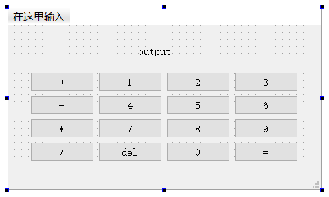

# C++提高

# C++提升篇01

## 1. 扩展阅读（阅读，加深对面向对象的理解）

[OO真经]：https://www.cnblogs.com/leoo2sk/archive/2009/04/09/1432103.html

【答】


## 2. 类与类之间的关系有哪几种？各自的特点怎样的？


## 3. 面向对象设计有哪些原则？各自的特点是什么？


## 4. 运用所学的UML类图的知识，画出“文本查询程序的扩展”作业的类图。【C++ Primer 15.9节作业】（可以贴图）


## 总结


# C++提升篇02

## 1. 设计模式可以分为几类？分别有哪些？


## 2. 什么是单例模式？它有哪些特点？


## 3. 什么是工厂模式？它有哪些特点？


## 4. 什么是观察者模式？它有哪些特点？


## 总结


# 数据库提高篇01

## 1. 简答题：什么是Redis?有哪些有优缺点？


## 2. 简答题：为什么要用 Redis /为什么要用缓存


## 3. 简答题：Redis为什么这么快？


## 4. 简答题：Redis有哪些常用数据类型？


## 5. 简答题：什么是Redis持久化？


## 6. 简答题：Redis 的持久化机制是什么？各自的优缺点？


## 7. 简答题：Redis key的过期时间和永久有效分别怎么设置？


## 8. 简答题：Redis事务的概念？Redis事务的三个阶段？Redis事务相关命令和事务的特征？


## 9. 简答题：将每种数据类型的命令多敲击一下，加深印象？（这个自己下面多敲一敲，熟悉一下，此题不交）


## 总结


# Qt框架01

## 1. 说明一下Qt生成的项目模板中有哪些文件和文件夹，分别有什么作用？

【答】

文件

```html
1001.pro
1001.pro.user（实际存在，但在Qt Creator中不显示）
main.cpp
mainwindow.cpp
mainwindow.h
mainwindow.ui
```

A、pro文件

**pro文件是项目构建文件，类似于Makefile**。

qmake是Qt提供的一个跨平台的构建工具，在构建项目时，IDE会根据pro文件生成相应的构建脚本，如Makefile或Visual Studio项目文件，再来进行项目的实际编译和链接。

**pro文件是qmake工具的输入文件，用于描述项目的结构、依赖关系以及构建过程**。

B、源代码文件main.cpp

框架自动生成的代码

```c++
#include "dialog.h"

#include <QApplication>

int main(int argc, char *argv[])
{
    QApplication a(argc, argv);
    Dialog w;
    w.show();
    return a.exec();
}
```

值得特别注意的类有两个：

- QApplication是事件循环类，其中的exec()方法开启事件循环，让进程可以处理操作系统传入的各种事件。
- Dialog是可视的对话框类，其中的show()方法在屏幕上绘制对话框和其他各种图形元素。

从某种意义上来说，QApplication是整个GUI应用的大脑，它负责接收和处理各种事件；而图形界面上各种可视的元素，比如例子中的对话框对象，就是GUI进程的身体，它控制了整个应用的外观。对于应用而言，QApplication对象可以开启永不停止的事件循环（若有必要可以创造派生类扩展其功能），而业务逻辑一般集中在各种可视元素上。

C、对话框对象的设计

dialog.h

```c++
#ifndef DIALOG_H
#define DIALOG_H

#include <QDialog>

QT_BEGIN_NAMESPACE
namespace Ui { class Dialog; }
QT_END_NAMESPACE

class Dialog : public QDialog
{
    Q_OBJECT

public:
    Dialog(QWidget *parent = nullptr);
    ~Dialog();

private:
    Ui::Dialog *ui;
};
#endif // DIALOG_H
```

dialog.cpp

```c++
#include "dialog.h"
#include "ui_dialog.h"

Dialog::Dialog(QWidget *parent)
    : QDialog(parent)
    , ui(new Ui::Dialog)
{
    ui->setupUi(this);
}

Dialog::~Dialog()
{
    delete ui;
}
```

- 在构造函数中，会首先调用Ui::Dialog的setupUi方法来创建静态图形界面，自定义的业务逻辑在后续代码中添加即可。
- Ui::Dialog的实现是根据ui文件自动生成，需要先构建才会生成（快捷键是ctrl+b）。

D、UI文件

可以通过ui文件，创建应用的静态图形界面。首先双击ui文件，此时Qt Creator的界面会切换到Qt Designer图形界面编辑器中。

在Qt Creator当中可以通过拖放组件的方式修改ui文件，在使用构建功能之后，Qt Creator在构建过程中会使用UIC工具，将ui文件翻译成对应的C++代码（本例中是Ui::Dialog），并且可以让用户在自己的代码中访问ui的各个对象。

接下来，可以将一个Label类型的组件拖入中心区域，此时在对象浏览器当中可以找到该对象。此外，在ui文件当中，所有的组件对象构成了一棵树结构。随后选中组件对象，用户可以在对象属性编辑器当中可以修改对象属性，从而影响应用程序的静态界面效果。

文件夹：

```html
1001：Qt项目1001的文件夹
在Qt Creator中显示，但实际不存在的目录：
Headers
Sources
Forms
```

A、1001目录存放所有的项目文件；

B、Headers目录存放用户自己写的头文件；

C、Sources目录存放用户自己写的源代码文件；

D、Forms目录存放静态界面文件。

## 2. Qt Creator中有哪几个模式，切换的快捷键是什么？

【答】

模式：

2个模式：编辑模式、设计模式

切换的快捷键：

快捷键Shift+F4，可以实现快速切换Designer和源代码；快捷键Esc，可以回退Designer到ui代码。

## 3. 如何查看某个Qt内置类的帮助文档，如何查看某个类的源代码？QApplication的继承体系是怎么样的？

答：使用快捷键F1可以打开帮助手册，F2可以转到类的定义。

- Dialog类派生自QDialog类，其构造函数中存在一个parent形参。
- Dialog类的实现部分是由另一个类Ui::Dialog来完成的，这里使用了pimpl技术来减少依赖。

## 4. 根据如下ui绘制一个计算器，先不实现计算的功能，只实现显示表达式和编辑表达式的功能；QString的append方法可以追加一个字符。



【答】代码

mainwindow.h

```c++
#ifndef MAINWINDOW_H
#define MAINWINDOW_H

#include <QMainWindow>

QT_BEGIN_NAMESPACE
namespace Ui { class MainWindow; }
QT_END_NAMESPACE

class MainWindow : public QMainWindow
{
    Q_OBJECT

public:
    MainWindow(QWidget *parent = nullptr);
    ~MainWindow();

private slots:
    void on_btn_1_clicked();

    void on_btn_2_clicked();

    void on_btn_3_clicked();

    void on_btn_4_clicked();

    void on_btn_5_clicked();

    void on_btn_6_clicked();

    void on_btn_7_clicked();

    void on_btn_8_clicked();

    void on_btn_9_clicked();

    void on_btn_0_clicked();

    void on_btn_add_clicked();

    void on_btn_sub_clicked();

    void on_btn_mul_clicked();

    void on_btn_div_clicked();

    void on_btn_del_clicked();

    void on_btn_equal_clicked();

private:
    Ui::MainWindow *ui;
};
#endif // MAINWINDOW_H
```

main.cpp

```c++
#include "mainwindow.h"

#include <QApplication>

int main(int argc, char *argv[])
{
    QApplication a(argc, argv);
    MainWindow w;
    w.show();
    return a.exec();
}
```

mainwindow.cpp

```c++
#include "mainwindow.h"
#include "ui_mainwindow.h"

MainWindow::MainWindow(QWidget *parent)
    : QMainWindow(parent)
    , ui(new Ui::MainWindow)
{
    ui->setupUi(this);
}

MainWindow::~MainWindow()
{
    delete ui;
}

void MainWindow::on_btn_1_clicked()
{
    QString str = ui->label->text();
    if(str == "output"){
        str = "";
    }
    str.append("1");
    ui->label->setText(str);
}

void MainWindow::on_btn_2_clicked()
{
    QString str = ui->label->text();
    if(str == "output"){
        str = "";
    }
    str.append("2");
    ui->label->setText(str);
}

void MainWindow::on_btn_3_clicked()
{
    QString str = ui->label->text();
    if(str == "output"){
        str = "";
    }
    str.append("3");
    ui->label->setText(str);
}

void MainWindow::on_btn_4_clicked()
{
    QString str = ui->label->text();
    if(str == "output"){
        str = "";
    }
    str.append("4");
    ui->label->setText(str);
}

void MainWindow::on_btn_5_clicked()
{
    QString str = ui->label->text();
    if(str == "output"){
        str = "";
    }
    str.append("5");
    ui->label->setText(str);
}

void MainWindow::on_btn_6_clicked()
{
    QString str = ui->label->text();
    if(str == "output"){
        str = "";
    }
    str.append("6");
    ui->label->setText(str);
}

void MainWindow::on_btn_7_clicked()
{
    QString str = ui->label->text();
    if(str == "output"){
        str = "";
    }
    str.append("7");
    ui->label->setText(str);
}

void MainWindow::on_btn_8_clicked()
{
    QString str = ui->label->text();
    if(str == "output"){
        str = "";
    }
    str.append("8");
    ui->label->setText(str);
}

void MainWindow::on_btn_9_clicked()
{
    QString str = ui->label->text();
    if(str == "output"){
        str = "";
    }
    str.append("9");
    ui->label->setText(str);
}

void MainWindow::on_btn_0_clicked()
{
    QString str = ui->label->text();
    if(str == "output"){
        str = "";
    }
    str.append("0");
    ui->label->setText(str);
}

void MainWindow::on_btn_add_clicked()
{
    QString str = ui->label->text();
    if(str == "output"){
        str = "";
    }
    str.append("+");
    ui->label->setText(str);
}

void MainWindow::on_btn_sub_clicked()
{
    QString str = ui->label->text();
    if(str == "output"){
        str = "";
    }
    str.append("-");
    ui->label->setText(str);
}

void MainWindow::on_btn_mul_clicked()
{
    QString str = ui->label->text();
    if(str == "output"){
        str = "";
    }
    str.append("*");
    ui->label->setText(str);
}

void MainWindow::on_btn_div_clicked()
{
    QString str = ui->label->text();
    if(str == "output"){
        str = "";
    }
    str.append("/");
    ui->label->setText(str);
}

void MainWindow::on_btn_del_clicked()
{
    QString str = ui->label->text();
    if(str == "output"){
        str = "";
    }
    if(str != ""){
        str.chop(1);
    }
    ui->label->setText(str);
}

void MainWindow::on_btn_equal_clicked()
{
    QString str = ui->label->text();
    if(str == "output"){
        str = "";
    }
    str.append("=");
    ui->label->setText(str);
}
```

## 总结

- Qt项目1001-4


# Qt框架02

## 1. QString和std::string和char数组有什么区别？QString增删改查用什么成员函数？

【答】

区别：

**QString**：Qt在为了方便用户使用字符串上面做了很多努力，设计出了功能更加丰富的QString类。Qt框架中使用QChar类来表示一个字符，QChar的编码是utf-16，无论是英文字符还是中文汉字都是占据了2个字节。对于字符串，Qt框架使用QString类来表示，QString是QChar的序列。

```c++
int main()
{
    QString str = "你好世界";
    QChar ch = str[0];
    qDebug() << "str = " << str << " ch = " << ch;
    //QChar %lc
    qDebug("ch = %lc\n", ch);
    return 0;
}
```

类似于std::string，QString也支持访问成员、拼接、截取、获取长度、删除和修改的操作。QString的接口和std::string不一样，功能也会更多一些。

**std::string**：由于零开销原则的限制，C++标准库的std::string为了性能，只提供了非常有限的功能；当涉及到中英文兼容这种跨语言问题时，不同编码格式的转换会让字符串的故事更加复杂。

**char数组**：C风格的字符数组形式的字符串字面值常量。

成员函数：

增：append()

删：remove()

改：replace()

查：indexOf()

## 2. 使用元对象系统的注意事项有哪些？

为了正确使用元对象，代码需要遵循下列步骤：

- 从QObject派生的含有Q_OBJECT宏的类的定义**必须在头文件**中，Q_OBJECT宏应该位于类声明的私有部分。
- 确保pro文件中，SOURCES变量包含了项目中的所有源文件，HEADERS变量包含了项目中所有的头文件。（如果使用Qt Creator，IDE会自动帮我们完成这一步骤）。
- 应该在头文件中使用逻辑指令（比如#ifndef）防止头文件被包含多次。
- QObject类应是基类列表中的第一个类。

```c++
// QWidget就是一个典型的使用元对象的例子
class Q_WIDGETS_EXPORT QWidget : public QObject, public QPaintDevice
{
    Q_OBJECT
    Q_DECLARE_PRIVATE(QWidget)
    // ...
};
```

## 3. 书写一个函数MyIntersection，可以支持两个相同的QList或者QSet的取交集的操作，返回新集合。书写一个函数MyOdd，可以将一个QMap<int,int>的所有奇数的键或者是值搜集起来，返回新QList。


## 4. 给出一个路径'/usr/include/dir1/dir2'：将路径切割并存入一个栈中；实现cd 子目录和cd 上一级功能，返回路径的字符串。


## 5. 根据如下ui绘制一个计算器，点击任何一个符号的时候直接输出运算结果。


## 6. 书写一个用于显示属性配置的程序：2个QLineEdit、3个QPushButton 1个QLabel；左边QLineEdit可以输入 ip port username password 等其他字符串；右边QLineEdit可以输入 左边属性对应的值；submit按钮可以提交数据。要求，所有的属性存入一个QMap中。


## 总结


# Qt框架03

## 1. 实现一个井字棋 点击空白按钮可以显示'X'或者'O'。


## 2. 信号和槽机制的目的是什么？书写代码实现一个自定义信号和自定义槽函数。


## 3. connect函数有几种重载形式？哪一种更好为什么？


## 4. 现在有三个对象A，B，C，需要实现下面效果：A发射信号会导致 B调用槽函数 C调用槽函数；B发射信号会导致 C调用槽函数；C发射信号会导致 A发射信号。


## 总结


# Qt框架04

## 1. 现在有三个对象ABC，A的父亲是B，B的父亲是C。

点击A的内部，要求执行：A的filter、event和event_handler；B的filter、event。

【答】


## 2. 实现一个“打蚊子”游戏。

在屏幕中央有一个600*400的QWidget，一个用来统计分数的QLabel；一开始会在QWidget内部随机位置生成一个蚊子，当鼠标点击到蚊子以后，旧蚊子消失然后在另一个位置生成新的蚊子，分数增加。

【答】


## 总结


# Qt框架05

## 1. 什么是窗口？怎么样创建一个窗口


## 2. 通过修改QWidget的构造函数的参数来显示不同风格的窗口，并在窗口中显示窗口选项

答：


## 总结


# Workflow01

## 1. Nginx和Apache最大区别是什么？


## 2. 使用Nginx部署一个产品的帮助文档服务器。


## 3. 有哪些负载均衡策略？各有什么优缺点？


## 4. 说明什么是幂等性？


## 5. 为什么需要将HTTP协议设计成无状态的呢？


## 总结


# Workflow02

## 1. 存在下列的redis键值映射关系，使用workflow的redis任务和序列，假如只知道"x1"，如何找到最终的"100"？

```html
"x1" --> "x2"
"x2" --> "x3"
"x3" --> "x4"
"x4" --> "100"
```

【答】


## 2. 读取某个网站的内容，并且存入redis服务端当中

（比如先访问淘宝，再set [www.taobao.com](http://www.taobao.com/) 淘宝的html内容）

【答】


## 总结

- 


# Workflow03

## 1. 实现分片上传功能

【答】


## 总结

- 


